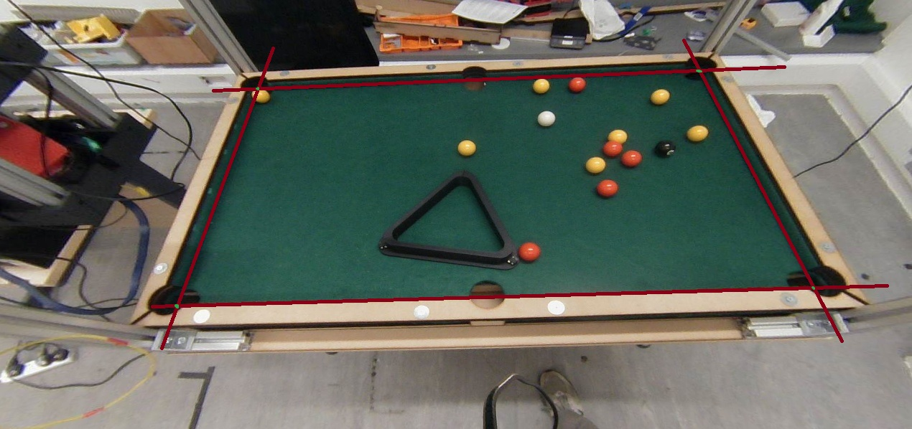
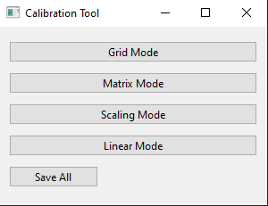
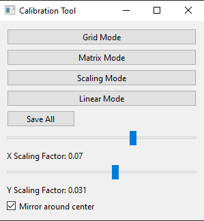
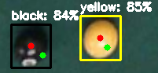

# **Pool-Pal - Computer Vision**

## **Overview**

This project performs real time pool ball detection using a trained computer vision model. It is capable of communicating with a gantry system and app, while detecting obstructions on the table.

## **Features**

- **Ball detection** - Performs ball detection using pre-trained computer vision model.
- **Camera calibration** - Calibrates the camera to remove distortion.
- **Coordinate calibration** - Includes a custom tool for configuring offsets from the camera detections to real-world coordinates.
- **Obstruction detection** - Uses an autoencoder to detect obstructions on the table for increased safety.
- **Configuration** - Key features can be modified with an intuative configuration file.
- **Network Communication** - Communicates with the Pool-Pal app and gantry system.

---

## **Installation**

### **Prerequisites**

Ensure you have Python **3.8+** installed. Then, install dependencies:

```bash
pip install -r requirements.txt
```

---

## **Usage**

### **Running the Project**

To start the program, simply run:

```bash
python main.py
```

- This will create a default configuration file.

### **Point Selection**

For best results, please select the points as close as you can to the image below.



This will ensure that only the surface area of the pool table is tracked, leading to accurate coordinates of detected balls.

Press `BACKSPACE` to remove the last placed point.

### **Configuration**

Modify `config.yaml` to adjust settings such as:

- Camera port
- Confidence threshold
- Position threshold
- Update interval
- Network settings
- Calibration mode

**Important settings**

- `camera_port` **Must** be set to a valid port (typically 0 or 1)
- `calibrate_camera` Default to `false`, if setting to `true` then camera calibration photos must be provided.
- `calibration_folder` Provide the folder name of the calibration photos.
  - Example: `calibration_folder : "./config/calibration/folder_cam"`
- `detection_model_path` Provide the path of a detection model if you wish to use your own.
- `network_update_interval` The frequency that the game state will be sent to the server.
- `calibration_mode` The coordinate calibration method.
  - `0`: Grid calibration
  - `1`: Camera matrix calibration
  - `2`: Scaling factor
  - `3`: Linear offset

Optionally create a new configuration profile with:

```bash
python main.py --create-profile [name]
```

### **Calibration Tool**

Run the calibration tool with:

```bash
python main.py --calibrate
```

This will load a GUI as shown below:



Selecting a mode will display sliders for calibration:



Changes to these values will be shown in real-time on the drawing frame.

Red dots are the detected positions, and the green dots are the calibrated positions.



### **Running with arguments**

There are optional arguments for running the program.

- `--set-points` - Set points for camera to crop
- `--no-anomaly` - Disable autoencoder for anomaly detection
- `--collect-model-images` - Collect images when holding `t` for use in model training. Images are saved to the path specified in config.
- `--collect-ae-data` - Collect images when holding `t` for use in the autoencoder. Images are saved to the path specified in config.
- `--file [path]` - Use a static image for testing.
- `--calibrate` - Loads the calibration tool.

## **License**

This project is licensed under the **MIT License**.
